<div align="center">

<br />

<!-- ═══ Hero ═══ -->
<picture>
  <source media="(prefers-color-scheme: dark)" srcset="https://readme-typing-svg.demolab.com?font=DM+Sans&weight=600&size=28&duration=2800&pause=1200&color=F8FAFC&center=true&vCenter=true&width=520&lines=KnowMedia;Plan+%E2%80%94+Create+%E2%80%94+Measure;Your+AI-native+social+workspace">
  
</picture>

<h3><em>The AI-native social workspace for modern brands</em></h3>

<br />

Plan feeds · Generate creatives · Schedule campaigns · Read the room — **one calm, cohesive surface.**

<br />

[](https://nextjs.org)
[](https://react.dev)
[](https://tailwindcss.com)
[](https://firebase.google.com)
[](https://ai.google.dev)
[](https://fastapi.tiangolo.com)

<br />

</div>

<p align="center">
  <a href="#at-a-glance">Overview</a> ·
  <a href="#whats-inside">Features</a> ·
  <a href="#architecture">Architecture</a> ·
  <a href="#quickstart">Quickstart</a> ·
  <a href="#project-structure">Structure</a> ·
  <a href="#api-surface">API</a> ·
  <a href="#scripts">Scripts</a> ·
  <a href="#roadmap">Roadmap</a> ·
  <a href="#tech-stack">Stack</a>
</p>

---

## Contents

<table>
<tr>
<td valign="top" width="50%">

**Get oriented**

1. [At a glance](#at-a-glance) — the loop in one diagram
2. [What's inside](#whats-inside) — six core surfaces, feature map
3. [Architecture](#architecture) — topology, request flow, routes

</td>
<td valign="top" width="50%">

**Build & ship**

4. [Quickstart](#quickstart) — prereqs, env, run
5. [Project structure](#project-structure) — directory map
6. [API surface](#api-surface) — Next handlers + FastAPI sidecar
7. [Scripts](#scripts) · [Roadmap](#roadmap) · [Tech stack](#tech-stack)

</td>
</tr>
</table>

---

## At a glance

**KnowMedia** is a Next.js workspace that brings **social planning**, **generative content**, **marketing automation**, and **cross-platform analytics** together under one roof. The frontend is a Next.js 15 App Router application with a Tremor + Recharts analytics surface and a Fabric-powered canvas editor. The backend is a small FastAPI service that talks to the Instagram Graph API. Generative tasks run on Google's Gemini models.

> Built for solo creators and small social teams who want to ship faster than they could with Buffer, Hootsuite, or Later — and who want reporting to feel **less like a spreadsheet** and **more like a dashboard**.

<br />

### Product loop

How teams move through the workspace — from intent to insight:

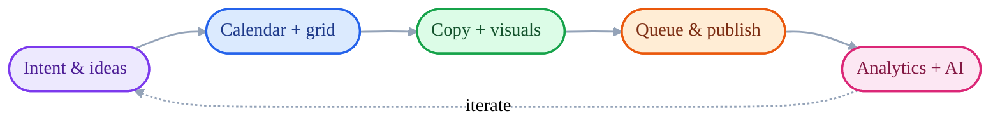

<br />

<div align="center">

| | | |
|:---:|:---:|:---:|
| **Plan** | **Create** | **Measure** |
| Editorial calendar, grid planner, drag-to-schedule | Gemini-assisted copy, Fabric-powered design canvas | Cross-platform analytics with AI insights |

</div>

<br />

---

## What's inside

<table>
<tr>
<td width="33%" valign="top">

### Content studio

Generate captions, hooks, and on-brand imagery via Gemini. Refine creatives inside a Fabric.js canvas with full layer control, then push straight to the publishing queue.

</td>
<td width="33%" valign="top">

### Unified analytics

Tremor + Recharts dashboards over Instagram, LinkedIn, and other platforms. The **AI Insights** pane summarises engagement, demographics, and what's working — in plain English.

</td>
<td width="33%" valign="top">

### Marketing automation

One-click marketing blasts across email and WhatsApp, with recent-send timelines. Drop-in templates, recipient segments, and delivery confirmations.

</td>
</tr>
<tr>
<td valign="top">

### Editorial calendar

A drag-to-schedule calendar grid with an in-place event creator. Visualise your campaign cadence and never publish two reels on the same day by accident.

</td>
<td valign="top">

### Feed manager

Plan your grid before it goes live. Rearrange posts, preview the gallery, and lock in a look that holds up across nine, twelve, and fifteen tiles.

</td>
<td valign="top">

### Creator profiles

Per-user profile pages with feed, posts, and engagement at a glance — useful for agencies running multiple handles or creators auditing peers.

</td>
</tr>
</table>

<br />

### Feature map

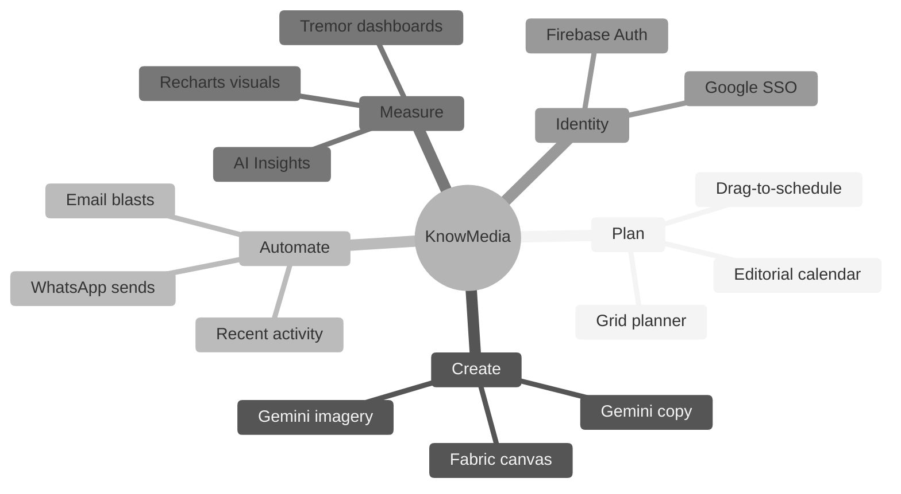

<br />

---

## Architecture

A four-tier layout: **Experience** (Next.js App Router) → **API gateway** (Next.js Route Handlers) → **Intelligence plane** (generation, automation, analytics) → **Model & data plane** (Gemini, Instagram Graph, Firebase).

### System topology

<p align="center">
  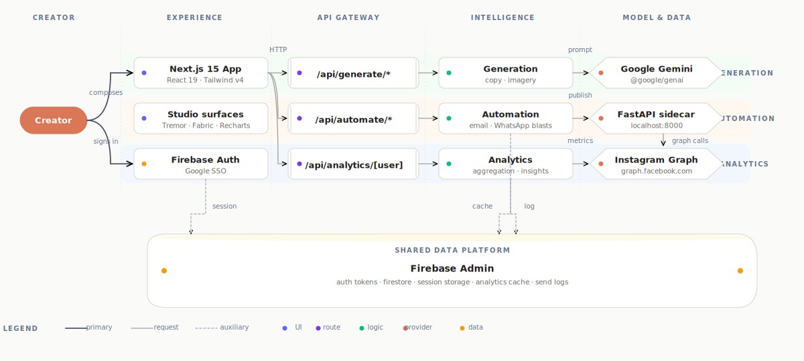
</p>

<details>
<summary>View as Mermaid source</summary>

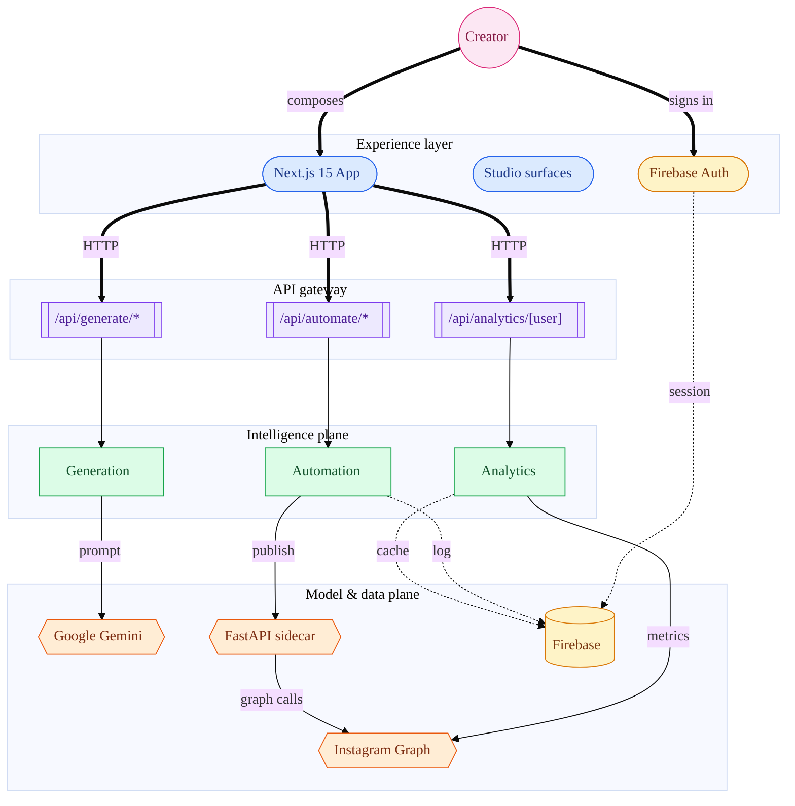

</details>

<br />

### Request voyage (generation example)

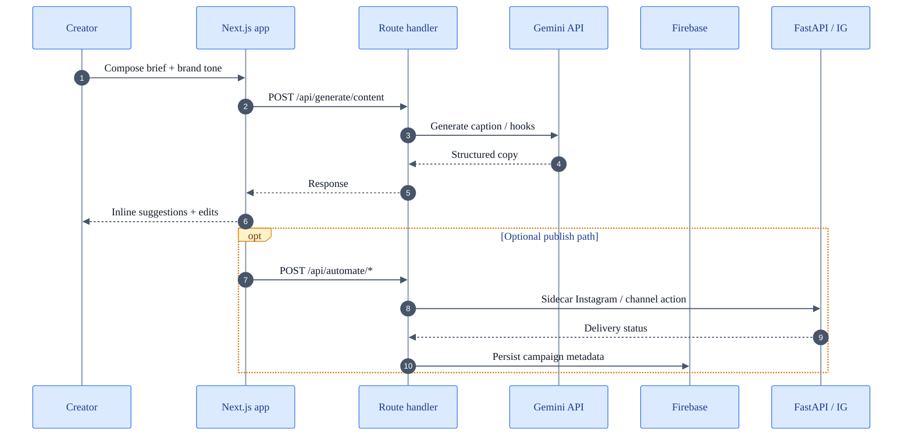

<br />

| Tier | What lives here | Key dependencies |
|------|-----------------|------------------|
| **Experience** | App Router pages, dashboards, canvas editor | `next`, `react`, `tailwindcss`, `@tremor/react`, `recharts`, `fabric`, `lucide-react`, `@heroicons/react` |
| **API gateway** | Server route handlers under `src/app/api/*` | `next` (server) |
| **Intelligence** | Content + image generation, automation, analytics handlers | `@google/genai`, `@google/generative-ai`, `uuid` |
| **Model & data** | Gemini, Instagram Graph, Firebase | `firebase`, FastAPI sidecar (`instagram_api.py`) |

<br />

### API routing overview

<p align="center">
  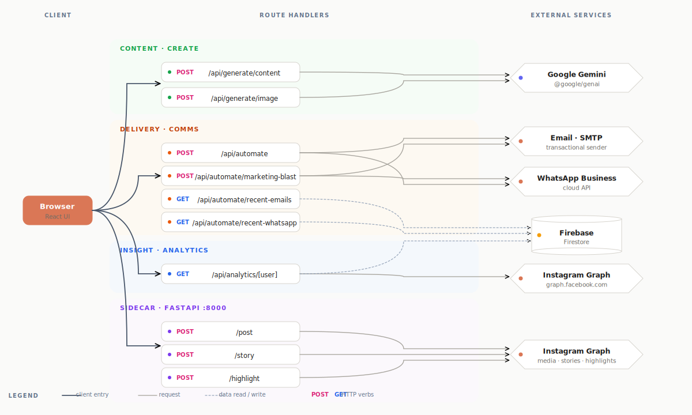
</p>

<details>
<summary>View as Mermaid source</summary>

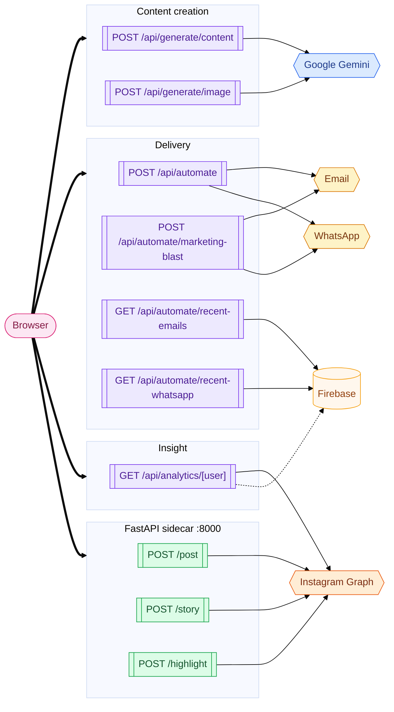

</details>

<br />

---

## Quickstart

### Prerequisites

- **Node.js** 20 or newer
- **npm** (or pnpm / yarn / bun)
- **Python** 3.11+ — for the Instagram backend
- **Firebase** project with a web app configured
- **Google AI Studio** API key for Gemini
- **Instagram Graph API** long-lived access token

### Install

```bash
git clone https://github.com/Aniruddh-fullstac/knowmedfia.git
cd knowmedfia
npm install
```

### Configure

Create `.env.local` at the project root:

```dotenv
# Firebase web SDK
NEXT_PUBLIC_FIREBASE_API_KEY=
NEXT_PUBLIC_FIREBASE_AUTH_DOMAIN=
NEXT_PUBLIC_FIREBASE_PROJECT_ID=
NEXT_PUBLIC_FIREBASE_STORAGE_BUCKET=
NEXT_PUBLIC_FIREBASE_MESSAGING_SENDER_ID=
NEXT_PUBLIC_FIREBASE_APP_ID=

# Google Gemini
GOOGLE_GENAI_API_KEY=

# Instagram backend
INSTAGRAM_GRAPH_TOKEN=
NEXT_PUBLIC_BACKEND_URL=http://localhost:8000
```

### Run

```bash
# Frontend — Next.js (http://localhost:3000)
npm run dev

# Backend — FastAPI Instagram sidecar (http://localhost:8000)
cd src/backend
pip install -r requirements.txt
uvicorn instagram_api:app --reload
```

Open <http://localhost:3000> and sign in with your Google account.

<br />

### Local runtime (two processes)

<div align="center">


</div>

<details>
<summary>View as Mermaid (source of truth)</summary>

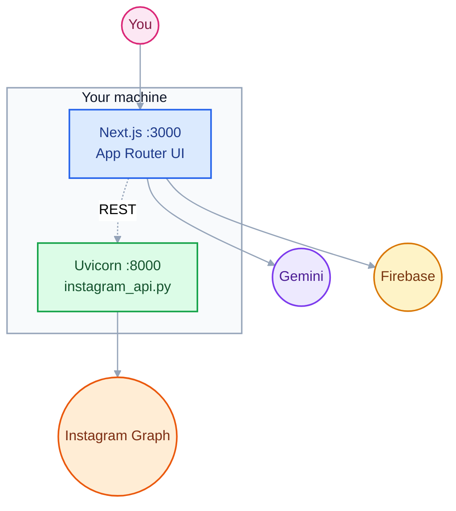

</details>

<br />

---

## Project structure

```text
KnowMedia/
├── public/                       Static assets — avatars, post imagery, icons
├── src/
│   ├── app/                      Next.js App Router
│   │   ├── api/
│   │   │   ├── analytics/        Per-username analytics endpoint
│   │   │   ├── automate/         Marketing blast · recent emails · recent WhatsApp
│   │   │   └── generate/         Content + image generation
│   │   ├── analytics/            Analytics dashboard
│   │   ├── automation/           Automation surface
│   │   ├── calendar/             Editorial calendar
│   │   ├── contentideas/         AI content ideation
│   │   ├── create/               New-post flow
│   │   ├── feed/                 Public feed view
│   │   ├── manage-feed/          Grid planner
│   │   ├── post/                 Post detail + create
│   │   ├── profile/              Creator profiles
│   │   └── components/           Page-scoped UI
│   │       ├── analytics/        AnalyticsDashboard, AIInsights, charts
│   │       ├── calendar/         CalendarGrid, EventCreator
│   │       ├── feed/             Grid, PostItem
│   │       ├── layout/           AppLayout, Navbar, Sidebar
│   │       └── post/             MediaDesigner (Fabric), PostCreator, PostItem
│   ├── backend/                  FastAPI Instagram sidecar
│   │   ├── instagram_api.py      /post · /story · /highlight
│   │   ├── requirements.txt
│   │   └── Dockerfile
│   └── components/               Shared UI (analytics charts, etc.)
├── next.config.mjs
├── postcss.config.mjs
├── jsconfig.json
└── package.json
```

<br />

---

## API surface

### Next.js route handlers

| Route | Purpose |
|-------|---------|
| `GET  /api/analytics/[username]` | Fetch analytics for a given handle |
| `POST /api/automate` | Trigger generic automation jobs |
| `POST /api/automate/marketing-blast` | Send a marketing blast across channels |
| `GET  /api/automate/recent-emails` | Pull recent email send history |
| `GET  /api/automate/recent-whatsapp` | Pull recent WhatsApp send history |
| `POST /api/generate/content` | Generate caption / copy via Gemini |
| `POST /api/generate/image` | Generate imagery via Gemini |

### FastAPI sidecar — Instagram Graph

| Route | Purpose |
|-------|---------|
| `POST /post` | Publish an image post with caption |
| `POST /story` | Publish a story |
| `POST /highlight` | Create a highlight cover |

Interactive docs at <http://localhost:8000/docs> (Swagger) or `/redoc`.

<br />

---

## Scripts

| Command | Description |
|---------|-------------|
| `npm run dev` | Start Next.js in development on port `3000` |
| `npm run build` | Production build |
| `npm start` | Start the production server |
| `npm run lint` | Run Next.js / ESLint checks |

<br />

---

## Roadmap

<p align="center">
  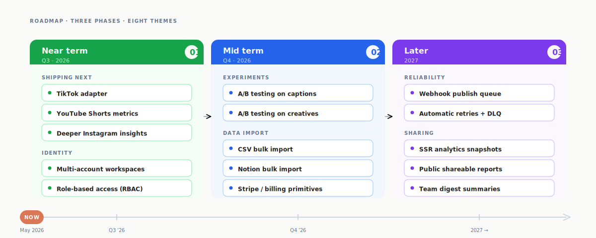
</p>

<details>
<summary>View as Mermaid source</summary>

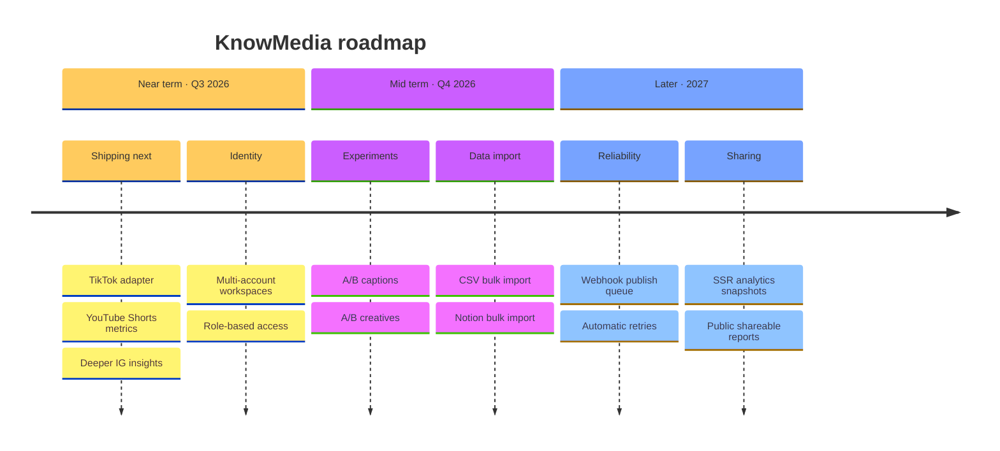

</details>

- TikTok and YouTube Shorts analytics adapters
- Multi-account workspaces with role-based access
- Native A/B testing for captions and creatives
- Bulk import from CSV and Notion
- Webhook-based publish queue with retries
- Server-side rendering for shareable analytics snapshots

<br />

---

## Tech stack

<table>
<tr>
<td valign="top" width="50%">

**Frontend**

- Next.js 15.2 (App Router)
- React 19
- Tailwind CSS v4
- Tremor 3 — dashboard primitives
- Recharts — composable charts
- Fabric.js 6 — canvas media editor
- Lucide React + Heroicons
- React Colorful — color pickers

</td>
<td valign="top" width="50%">

**Backend & services**

- Next.js Route Handlers
- FastAPI 0.95 + Uvicorn — Instagram sidecar
- Google Gemini via `@google/genai`
- Firebase 11 — auth + persistence
- Instagram Graph API
- UUID for ID generation
- Docker — backend container

</td>
</tr>
</table>

<br />

### Stack at a glance

<p align="center">
  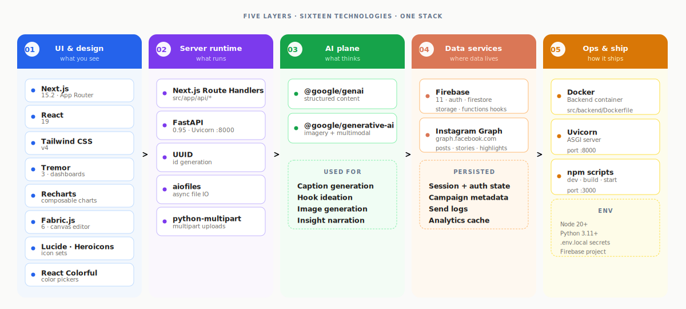
</p>

<details>
<summary>View as Mermaid source</summary>

```mermaid
%%{init: { "theme": "base" }}%%
flowchart LR
  subgraph L_UI["UI &amp; design"]
    UI1["Next.js 15"]:::ui
    UI2["React 19"]:::ui
    UI3["Tailwind v4"]:::ui
    UI4["Tremor"]:::ui
    UI5["Recharts"]:::ui
    UI6["Fabric.js"]:::ui
  end
  subgraph L_API["Server"]
    API1["Route Handlers"]:::api
    API2["FastAPI"]:::api
    API3["UUID"]:::api
  end
  subgraph L_AI["AI plane"]
    AI1["@google/genai"]:::ai
    AI2["@google/generative-ai"]:::ai
  end
  subgraph L_DATA["Data"]
    D1["Firebase 11"]:::data
    D2["Instagram Graph"]:::data
  end
  subgraph L_OPS["Ops"]
    O1["Docker"]:::ops
    O2["Uvicorn"]:::ops
  end
  L_UI ==> L_API ==> L_AI ==> L_DATA ==> L_OPS
  classDef ui   fill:#dbeafe,stroke:#2563eb,color:#1e3a8a
  classDef api  fill:#ede9fe,stroke:#7c3aed,color:#4c1d95
  classDef ai   fill:#dcfce7,stroke:#16a34a,color:#14532d
  classDef data fill:#ffedd5,stroke:#ea580c,color:#7c2d12
  classDef ops  fill:#fef3c7,stroke:#d97706,color:#78350f
```

</details>

<br />

---

<div align="center">

**Built with care.**  
<sub><strong>KnowMedia</strong> · 2026</sub>

</div>
